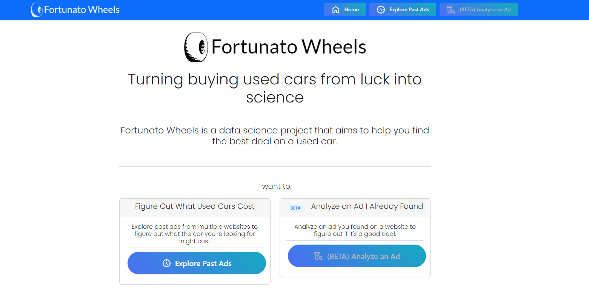
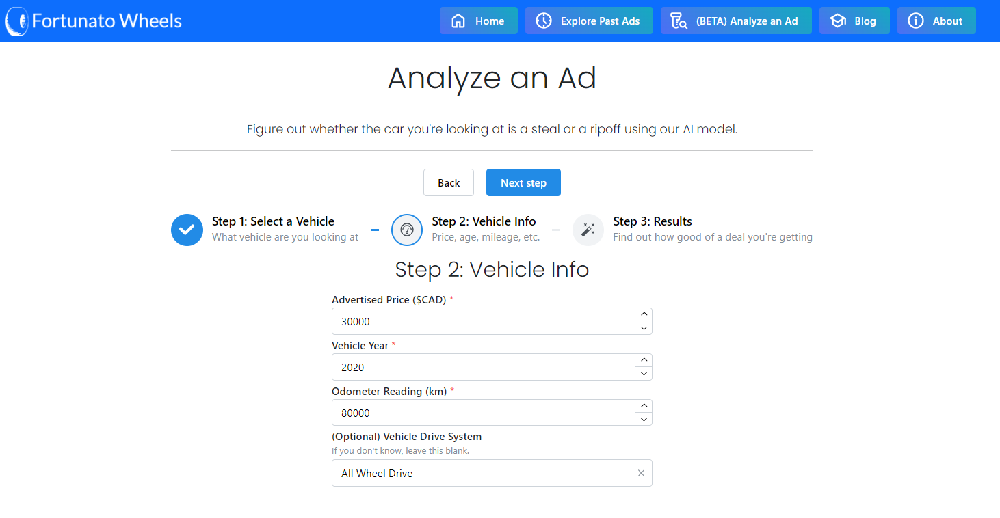
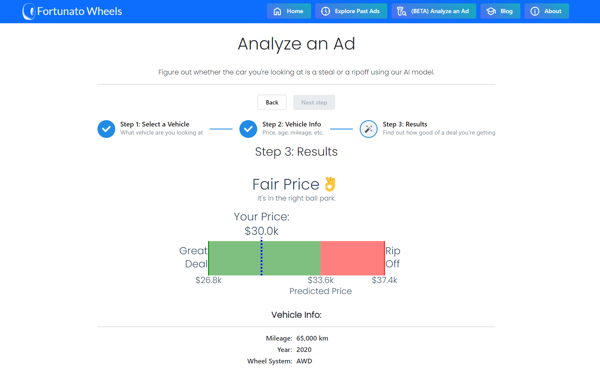
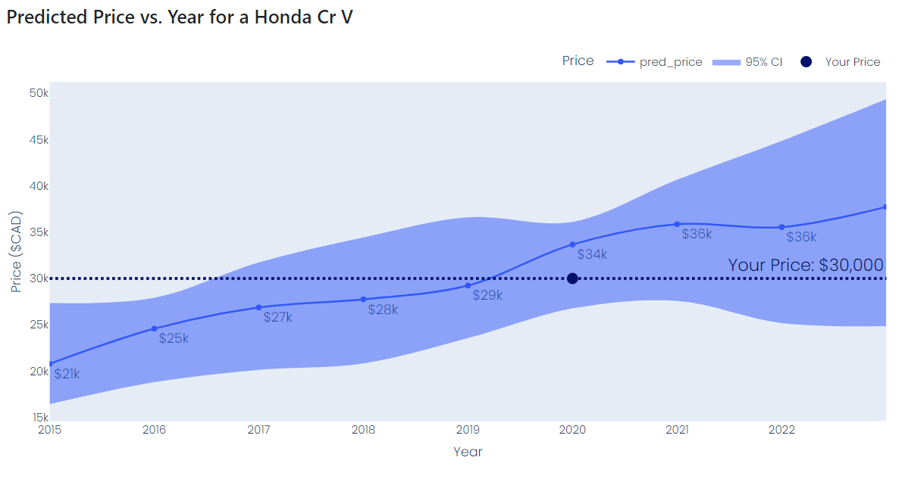
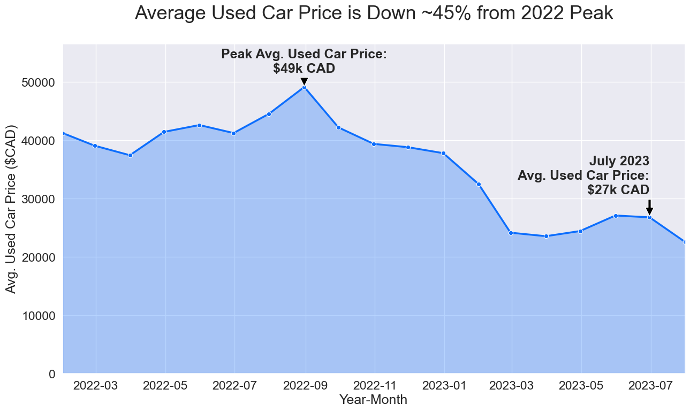
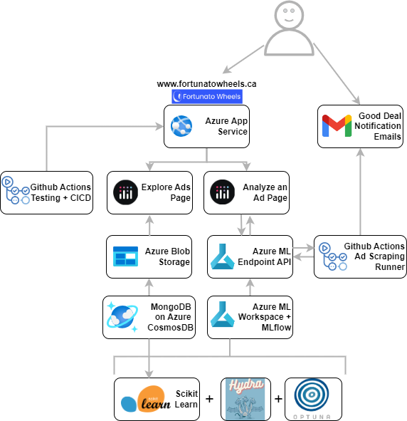
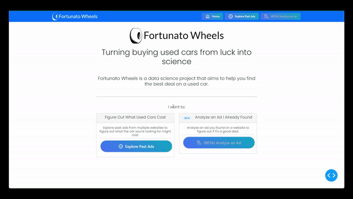

[![Contributors][contributors-shield]][contributors-url]
[![Forks][forks-shield]][forks-url]
[![Stargazers][stars-shield]][stars-url]
[![Issues][issues-shield]][issues-url]
[![MIT License][license-shield]][license-url]
[![codecov][codecov-shield]][codecov-url]

(Fortunato: Latin for "lucky")

Fortunato wheels takes the guesswork out of buying a used car. It does this by compiling datasets of used cars from multiple websites, analyzing the data to identify trends and baselines for car prices, then make this information available to users in an interactive tool to evaluate car prices.

**Try it out here!** *June 2024 Update: I've stopped hosting the site for now to reduce my hosting costs, please reach out if you'd like to see it in action

## Goal: Help myself buy a new car at a good price and learn along the way

At the start of this project I was planning to buy a new car in 6 months time and had some fresh data science skills I wanted to apply. I decided to build Fortunato Wheels to:
- monitor used car site prices for me
- help me know if a price was good or bad
- explore a large (>3M) ads dataset to see what might be lurking in the data

The original proposal for this personal project is located [here](PROPOSAL.md).

## Analyze an Ad

Once you have an ad you're interested in, you can analyze it to see how it compares to the rest of the ads in the dataset. You can see the ad's price, mileage, condition, and location. You can also see how the ad compares to the rest of the ads in the dataset in terms of predicted price and our confidence intervals for that make, model, year, and condition.

Ultimately you want to know if you should jump on the deal or keep looking. Fortunato Wheels will help you make that decision:

I also found it useful to see how vehicle prices compared over similar years so you can see confidence intervals (P5, P95) predicted by the model.

There are some interesting insights around the impact of COVID on the used car market I tried to pick apart from the data.

## Automatic Ad Monitoring

As I ran the system I setup a configurable ad notification system that on any new ads would check for cars that match my criteria and have a substantially below average price. These would get emailed out to whomever had a filter setup. At one point I had 4-5 people signed up receiving emails on new ads that matched their criteria.

This used the Fortunato Wheels car price prediction API during scraping to store the predicted price at scrape time for quick/easy inspection.

Here is a sample email that would be sent out:

## Project Architecture

As this was a side project during my masters I wanted to try out some new technologies but move fast.

- **Front end:** Plotly Dash hosted on Azure App Service
- **Model development:** sklearn regressors, final model gradient boosting regressor packaged for deployment, Azure ML worskspace for MLflow model and experiment tracking
- **Hyperparam tuning:** Bayesian Optimization with Optuna connected with Hydra configuration for model training  
- **ML Endpoint for Model Prediction:** Cost Optimized Azure ML Endpoint (hyper-low cost configuration)
- **Data Storage:** Mongo DB on Azure Cosmos DB for ad scraping and model training data 
- **CICD**: Github Actions for testing & deployment directly to Azure App Service
  
**Overall System Diagram**
  

## Exploration of the 3M+ ads dataset

Last but not least, you could start using Fortunato wheel by browsing through the database of used car ads. You can filter by make, model, year, price, and condition. You can also use the slider to filter by mileage. This was all done on an aggregated dataset of 3M+ ads compressed to parquet so it could be loaded into the web app from blob storage quickly.

1. Use the dropdowns on the left to filter by make, model, year and price. Once happy with your filters click the "Apply Filters" button. The number of matching ads will be displayed at the bottom of the filters so you know how many ads you're looking at.
2. Look at the price by manufacturer and year on the right and observe how the best fit line (LOWESS model) changes based on your filters
3. Check out what the distribution of vehicles condition/mileage looks like on the bottom two plots

## References

Additional data was added to our dataset from the following sources during model development:
- Craigslist Used Cars Dataset, Austin Reese, https://www.kaggle.com/datasets/austinreese/craigslist-carstrucks-data

[contributors-shield]: https://img.shields.io/github/contributors/tieandrews/fortunato-wheels.svg?style=for-the-badge
[contributors-url]: https://github.com/tieandrews/fortunato-wheels/graphs/contributors
[forks-shield]: https://img.shields.io/github/forks/tieandrews/fortunato-wheels.svg?style=for-the-badge
[forks-url]: https://github.com/tieandrews/fortunato-wheels/network/members
[stars-shield]: https://img.shields.io/github/stars/tieandrews/fortunato-wheels.svg?style=for-the-badge
[stars-url]: https://github.com/tieandrews/fortunato-wheels/stargazers
[issues-shield]: https://img.shields.io/github/issues/tieandrews/fortunato-wheels.svg?style=for-the-badge
[issues-url]: https://github.com/tieandrews/fortunato-wheels/issues
[license-shield]: https://img.shields.io/github/license/tieandrews/fortunato-wheels.svg?style=for-the-badge
[license-url]: https://github.com/tieandrews/fortunato-wheels/blob/master/LICENSE.txt
[codecov-shield]: https://img.shields.io/codecov/c/github/tieandrews/fortunato-wheels?style=for-the-badge
[codecov-url]: https://codecov.io/gh/tieandrews/fortunato-wheels
