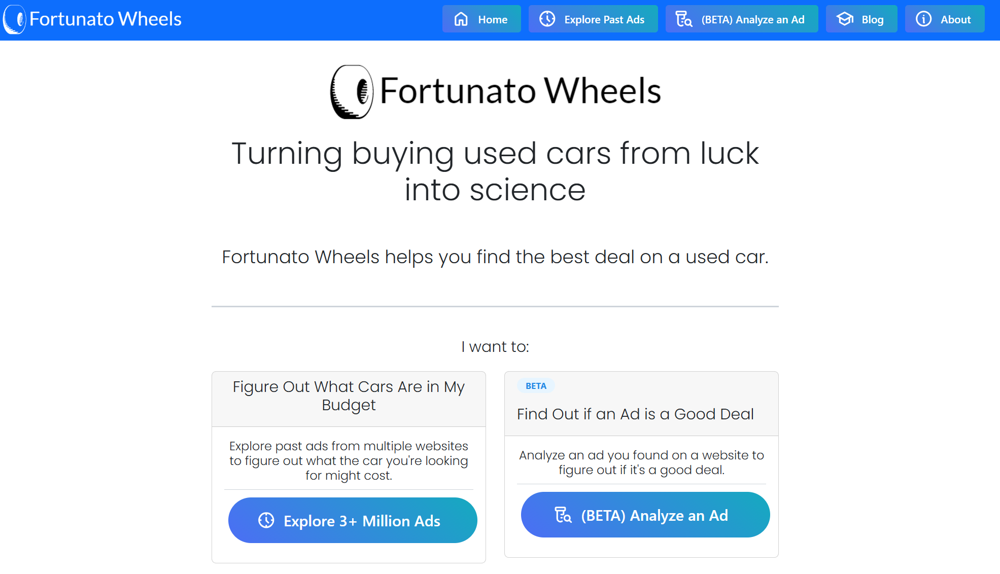

[![Contributors][contributors-shield]][contributors-url]
[![Forks][forks-shield]][forks-url]
[![Stargazers][stars-shield]][stars-url]
[![Issues][issues-shield]][issues-url]
[![MIT License][license-shield]][license-url]
[![codecov][codecov-shield]][codecov-url]

# Fortunato Wheels
(Fortunato: Latin for "lucky")

Fortunato wheels takes the guesswork out of buying a used car. It does this by compiling datasets of used cars from multiple websites, analyzing the data to identify trends and baselines for car prices, then make this information available to users in an interactive tool to evaluate car prices.

[Try it out here!](https://fortunato-wheels.onrender.com)

The proposal for this project is located [here](PROPOSAL.md).

The project currently has 2 primary focuses:

1. **Exploration**
   - When starting out looking for cars use Fortunato wheels to figure out what you're looking for and where your budget puts you in terms of makes, models, mileage etc.
   - To manage loading times currently only Honda and Toyota vehicles are used in the tool. This will be expanded in the future.

2. **(Under Development) Analysis**
   - If you have a car ad in mind and want to find out whether it's a good deal use the Analysis tools to see were it falls against our database of vehicle ads

## Exploration Usage

To start using Fortunato wheels you can browse through our database of used car ads. You can filter by make, model, year, price, and condition. You can also use the slider to filter by mileage.

1. Use the dropdowns on the left to filter by make, model, year and price. Once happy with your filters click the "Apply Filters" button. The number of matching ads will be displayed at the bottom of the filters so you know how many ads you're looking at.
2. Look at the price by manufacturer and year on the right and observe how the best fit line (LOWESS model) changes based on your filters
3. Check out what the distribution of vehicles condition/mileage looks like on the bottom two plots
## References

- Craigslist Used Cars Dataset, Austin Reese, https://www.kaggle.com/datasets/austinreese/craigslist-carstrucks-data

[contributors-shield]: https://img.shields.io/github/contributors/tieandrews/fortunato-wheels.svg?style=for-the-badge
[contributors-url]: https://github.com/tieandrews/fortunato-wheels/graphs/contributors
[forks-shield]: https://img.shields.io/github/forks/tieandrews/fortunato-wheels.svg?style=for-the-badge
[forks-url]: https://github.com/tieandrews/fortunato-wheels/network/members
[stars-shield]: https://img.shields.io/github/stars/tieandrews/fortunato-wheels.svg?style=for-the-badge
[stars-url]: https://github.com/tieandrews/fortunato-wheels/stargazers
[issues-shield]: https://img.shields.io/github/issues/tieandrews/fortunato-wheels.svg?style=for-the-badge
[issues-url]: https://github.com/tieandrews/fortunato-wheels/issues
[license-shield]: https://img.shields.io/github/license/tieandrews/fortunato-wheels.svg?style=for-the-badge
[license-url]: https://github.com/tieandrews/fortunato-wheels/blob/master/LICENSE.txt
[codecov-shield]: https://img.shields.io/codecov/c/github/tieandrews/fortunato-wheels?style=for-the-badge
[codecov-url]: https://codecov.io/gh/tieandrews/fortunato-wheels
